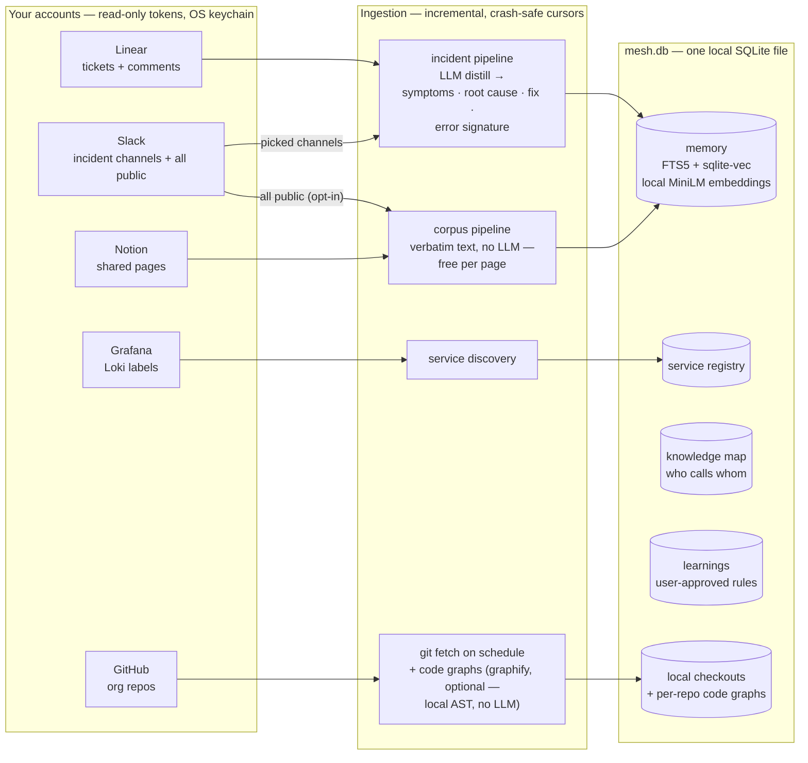
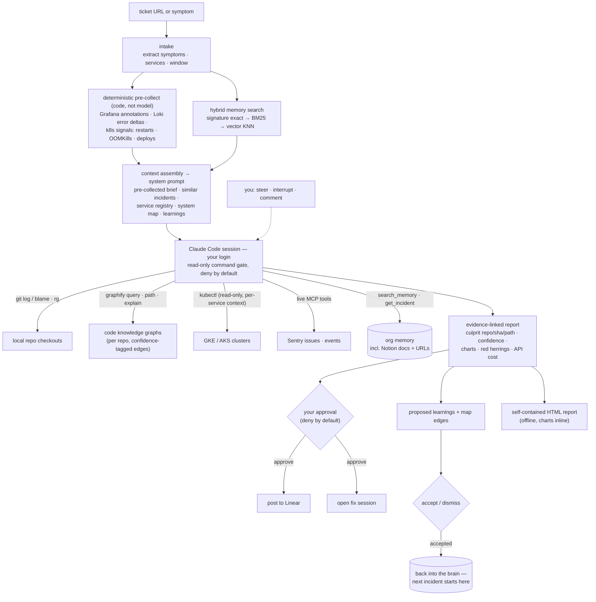

# Mesh

**An incident-investigation agent that starts out already knowing your org.**

Mesh is a local desktop app (macOS, Electron). You hand it a ticket or a symptom — *"checkout 5xx spike"*, *"no transcript generated"* — and it investigates across your repos, your observability, and your own incident history, then returns an evidence-linked root cause, down to the culprit commit and line.

The bet behind it: for incident response, the bottleneck isn't model capability — it's **organizational context**. A bare coding agent doesn't know your services, your deploy pipeline, or that this exact symptom happened twice last quarter and how it was fixed. Mesh does, because it builds that memory first and improves it after every investigation.

Everything runs on your machine, on your own accounts. There is no hosted service.

## What it does

- **Builds a searchable org memory, two pipelines** — *incident* sources (Linear tickets with comment threads, your chosen Slack incident/RCA channels) are LLM-distilled into structured fields (symptoms · root cause · resolution · error signature); *corpus* sources (every shared Notion page, and — opt-in — **every public Slack channel**) are stored verbatim at zero LLM cost, each hit linking back to its page or thread. Everything is indexed three ways: exact error-signature, full-text (FTS5/BM25), and semantic vectors from a *local* embedding model. "Staff can't open the dashboard" finds "site can't be reached" with zero shared words.
- **Runs real investigations** — spawns a Claude Code session (via *your* Claude login — the Agent SDK, no API key of Mesh's own) inside your local repo checkouts, primed with a versioned SRE runbook, the similar past incidents, your service registry, and your system topology. The session is **read-only by default**: git log/blame, ripgrep, kubectl reads, live Sentry MCP tools, mid-run memory search — and, when [graphify](https://github.com/Graphify-Labs/graphify) is installed, **per-repo code knowledge graphs**: "how does checkout reach settlement.ts" is answered by one `graphify path` traversal with confidence-tagged edges instead of a grep expedition. Graphs are built locally by deterministic AST parsing (no LLM, nothing leaves the machine) during the background repos sync, never by the session itself.
- **Names culprits with evidence** — reports carry a confidence tier, a culprit `repo/sha/path`, ranked suspects, a structured root-cause story (numbered points, per-service verdicts, measured charts, red herrings, honest unknowns), and an evidence chain where **every claim cites its query, command output, or commit**. A claim without a source doesn't ship.
- **Gates every write behind you** — any mutating action pops an approval modal (deny by default, 10-minute timeout = deny, deny-all on window close). Posting the report to Linear, opening a fix session in your terminal — all explicit approvals, all audited.
- **Gets smarter with your sign-off** — each report proposes reusable learnings and knowledge-map edges it *verified during the run*. You accept or dismiss; only accepted items ever ride in future prompts. Finished investigations are written back into memory, so the next similar incident starts from this one's answer.

## How it fits together

Two halves: a **brain** that ingests the org in the background, and an **investigation loop** that pulls from all of it on demand.

### The brain — how the org gets in



### An investigation — how it pulls from everything



Every write crosses an approval gate; every claim in the report cites the query, command output, or commit it came from. The deep dive — the exact agentic loop, the permission gate, the report schema, a real annotated trace — is in [`agent-loop.md`](./agent-loop.md). Design history lives in [`architecture.md`](./architecture.md) and [`ideation.md`](./ideation.md). Connecting sources and writing new connectors: [`docs/connecting-sources.md`](./docs/connecting-sources.md) · [`docs/building-a-connector.md`](./docs/building-a-connector.md).

## Local-first, by construction

One SQLite file (`mesh.db` in your user-data dir) holds everything: memory, investigations, the full event-by-event transcript of every session, learnings, the knowledge map, token/cost telemetry. Embeddings are computed locally (MiniLM in a worker process — no embedding API). Source tokens live in the OS keychain via Electron `safeStorage`, encrypted before they ever touch the database. The agent runs on your own Claude subscription. Nothing is hosted, nothing phones home.

## Getting started

```bash
npm install          # postinstall fetches both native prebuilds — no compiler needed
npm run electron:dev # the desktop app, hot-reloading
```

Then, inside the app:

1. **Connections** — add your Grafana instance(s) (read-scoped token; service discovery reads your Loki labels and drafts a service registry mapped to your local repos), your Linear API key, Slack (paste a token, *pick* your incident/RCA channels from a live list, and optionally flip **Index all public channels** for the verbatim corpus — a user token reads channels without invites), Notion (share pages with the integration; they ingest verbatim with backlinks), and optionally Sentry (the agent gets live issue/event/trace tools). Every dialog carries a step-by-step token guide, and each card reports what actually arrived — counts, sync recency, and zero-yield states that say why.
2. **Memory → Refresh** — first run is the backfill; every run after is incremental via per-source cursors. Sync is crash-safe: cursors only advance after a complete walk, and re-walks are absorbed idempotently.
3. **Knowledge map → Seed from description** — paste a plain-language description of your system (or an architecture doc); one cheap model call extracts services and who-calls-whom into an editable map. Mesh ships knowing nothing about anyone's org — this is where *yours* comes in. Investigations propose additions from then on.
4. **Optional: code graphs** — `uv tool install graphifyy` and the next repos sync builds a queryable knowledge graph for every service-mapped repo (local tree-sitter AST — free, incremental). Sessions then answer structure questions ("what calls X?", "how does A reach B?") with one graph traversal instead of grepping, and cite the path as evidence. Not installed → everything degrades to `rg` exactly as before.
5. **New investigation** — paste a ticket URL or describe a symptom. Watch the timeline; steer it mid-flight; approve or deny anything that wants to write.

### Packaging a DMG

```bash
npm run dist
```

Builds the renderer + main bundles and packages `release/Mesh-<version>-arm64.dmg` (unsigned — right-click → Open on first launch). Delete any old DMG from `release/` first if you're checking file dates to tell builds apart — electron-builder won't clean stale artifacts for you.

## Development

```bash
npm run dev          # UI only, in the browser at :5173 — MockApi with a scripted demo investigation
npm run typecheck    # renderer + main tsconfigs
npm test             # vitest — pure modules + repos against :memory: SQLite
npm run sync:once    # headless one-shot sync (ops/diagnostics, no window)
```

Browser mode runs entirely on mock data — fast visual iteration with no Electron and no credentials. Inside Electron the same UI talks to the real backend over a typed IPC contract (`src/shared/ipc.ts`), allowlisted channel-by-channel in the preload.

### Native modules (the one sharp edge)

better-sqlite3 needs a binary per ABI. `scripts/rebuild-native.mjs` (runs on postinstall) fetches **two prebuilds**: the Node-ABI one (stashed at `better-sqlite3/build/Release/node/`, used by vitest) and the Electron-ABI one (default path, used by the app). No compiler toolchain needed. If Electron ever bumps: `npm run rebuild:native`.

### Layout

```
src/shared/     types + the typed IPC contract (single vocabulary for both sides)
src/main/       Electron main: db (migrations, repos) · sync (Linear/Slack, distill, scheduler)
                · memory (hybrid search, embeddings worker) · engine (runbook, sessions, reports)
                · providers (Claude Agent SDK / Codex behind one interface) · ipc (handlers, approval broker)
src/preload/    the only bridge — two functions, channel-allowlisted
src/renderer/   Vite + React + Tailwind on the PRESS design system (dark-first, ink + signal-yellow)
scripts/        build, dev-watch, native prebuilds, benchmark harness
```

## Honest status

Mesh is young and was built as a personal internal tool first. It works end-to-end on real incidents — including finding a two-commit interaction and an actual fix commit that a bare coding agent missed — but the benchmark harness (Mesh vs. plain Claude Code vs. Claude + runbook, blind-graded on real resolved tickets) has only a handful of trials so far, and per-investigation token cost is measured but not yet tuned. macOS/arm64 is the only packaged platform today. Read the reports skeptically; that's what the evidence chain is for.
