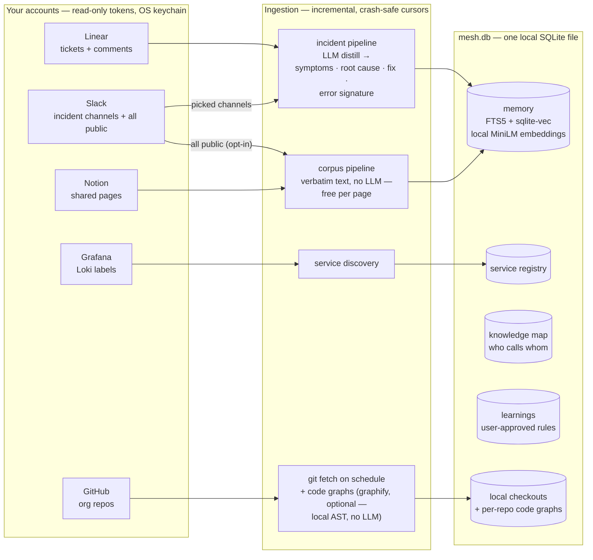
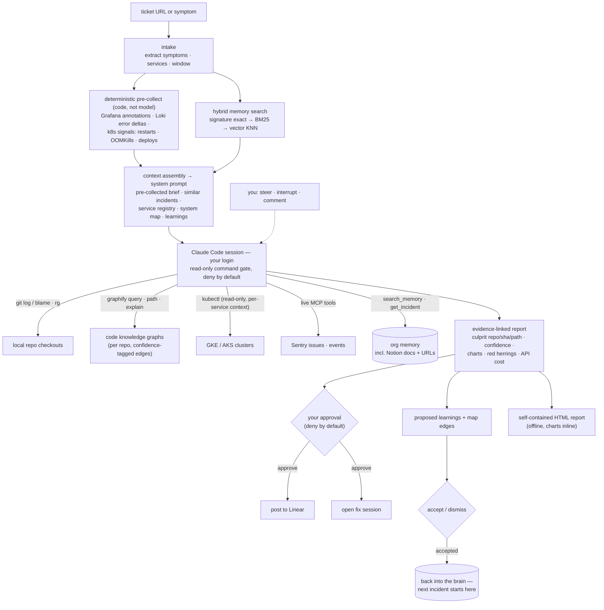
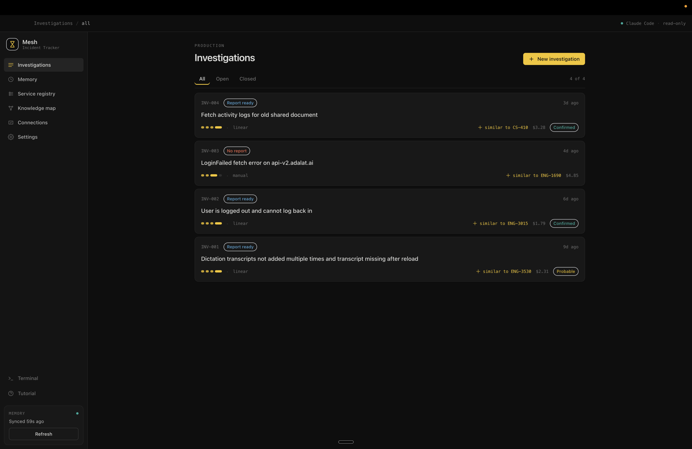
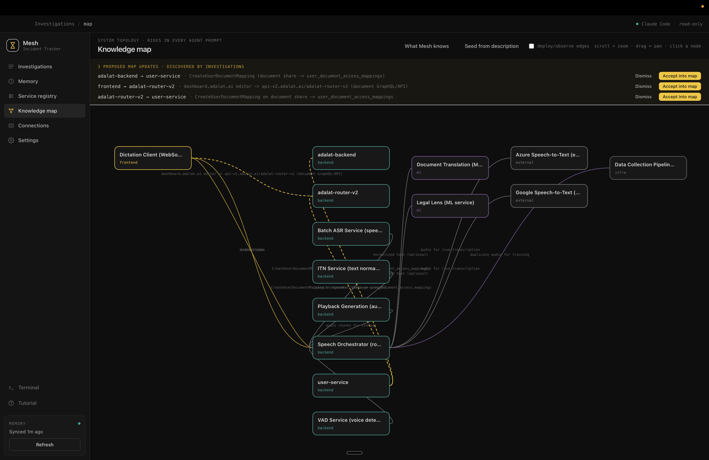
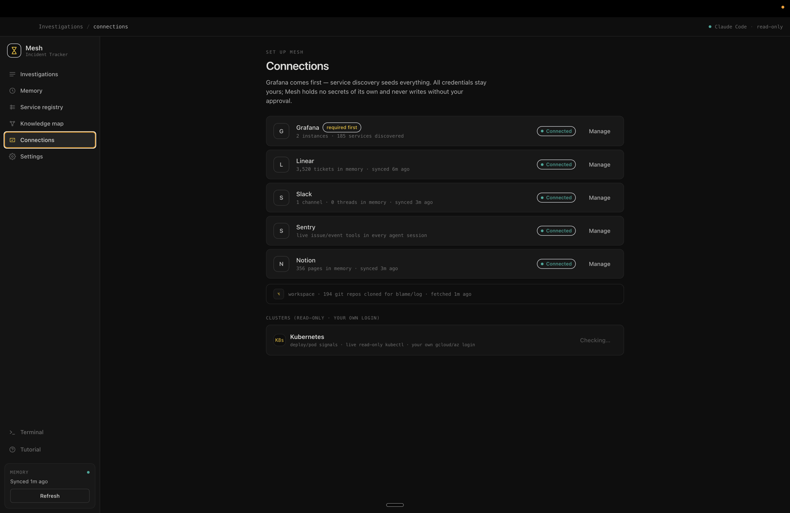
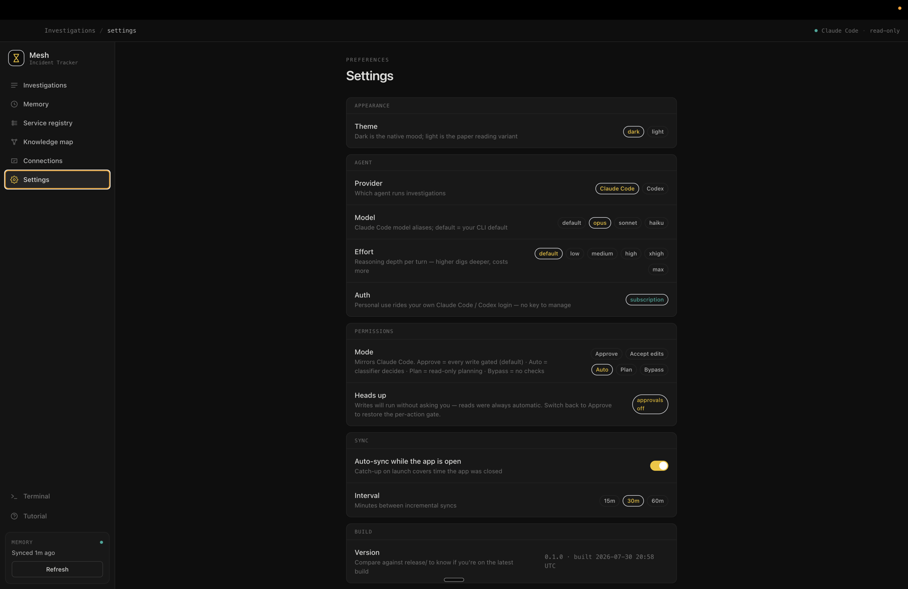
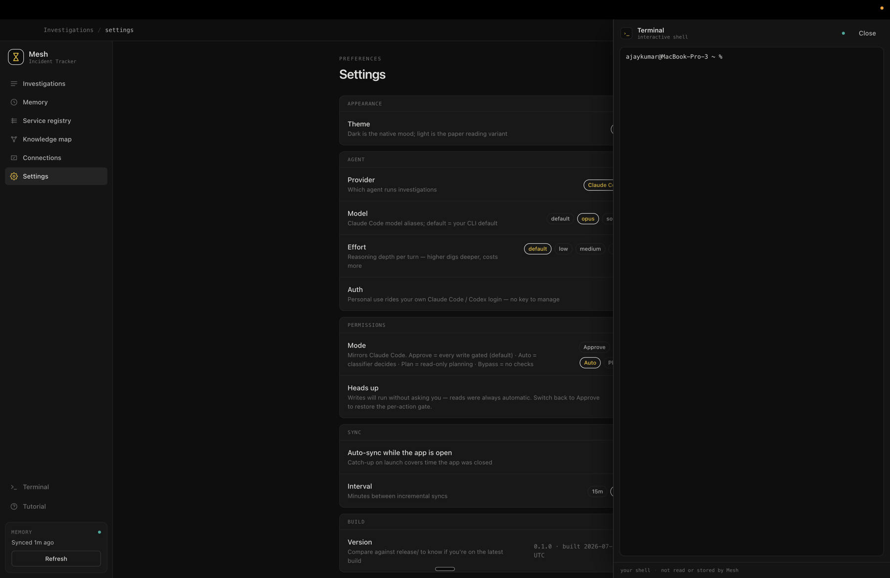
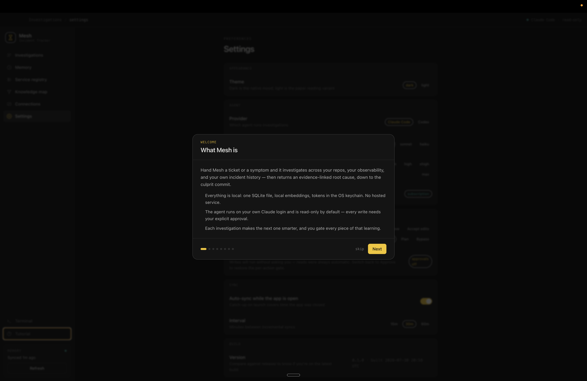

# Mesh

**An incident-investigation agent that starts out already knowing your org.**

> 🚧 **Public alpha** — Mesh works end-to-end on real incidents, but it is young and moving fast: schemas, IPC contracts, and connectors may change without notice. macOS (arm64) is the only packaged platform today.

Mesh is a local desktop app (macOS, Electron). You hand it a ticket or a symptom — *"checkout 5xx spike"*, *"no transcript generated"* — and it investigates across your repos, your observability, and your own incident history, then returns an evidence-linked root cause, down to the culprit commit and line.

The bet behind it: for incident response, the bottleneck isn't model capability — it's **organizational context**. A bare coding agent doesn't know your services, your deploy pipeline, or that this exact symptom happened twice last quarter and how it was fixed. Mesh does, because it builds that memory first and improves it after every investigation.

Everything runs on your machine, on your own accounts. There is no hosted service.


## What it does

**Builds a searchable org memory — two pipelines.**

- *Incident* sources (Linear tickets + comment threads, your picked Slack incident/RCA channels) are LLM-distilled into structured fields: symptoms · root cause · resolution · error signature.
- *Corpus* sources (every shared Notion page and, opt-in, **every public Slack channel**) are stored verbatim — zero LLM cost, every hit links back to its page or thread.
- Indexed three ways: exact error signature, full-text (FTS5/BM25), and semantic vectors from a *local* embedding model — "staff can't open the dashboard" finds "site can't be reached" with zero shared words.

**Runs real investigations.**

- Spawns a Claude Code session on *your* Claude login (the Agent SDK — Mesh has no API key of its own) inside your local repo checkouts.
- Primed with a versioned SRE runbook, the similar past incidents, your service registry, and your system topology.
- **Read-only by default**: git log/blame, ripgrep, kubectl reads, live Sentry MCP tools, mid-run memory search.
- With [graphify](https://github.com/Graphify-Labs/graphify) installed, **per-repo code knowledge graphs**: "how does checkout reach settlement.ts" is one `graphify path` traversal with confidence-tagged edges, not a grep expedition. Graphs build locally (deterministic AST, no LLM) during the background repos sync — never inside a session.

**Names culprits with evidence.**

- Confidence tier · culprit `repo/sha/path` · ranked suspects · measured charts, red herrings, honest unknowns.
- **Every claim cites its query, command output, or commit.** A claim without a source doesn't ship.

**Gates every write behind you.**

- Any mutating action pops an approval modal — deny by default, 10-minute timeout = deny, deny-all on window close.
- Posting to Linear, opening a fix session: explicit approvals, all audited.

**Gets smarter with your sign-off.**

- Reports propose learnings and map edges *verified during the run*; only what you accept rides in future prompts.
- Finished investigations write back into memory — the next similar incident starts from this one's answer.

## How it fits together

Two halves: a **brain** that ingests the org in the background, and an **investigation loop** that pulls from all of it on demand.

### The brain — how the org gets in



### An investigation — how it pulls from everything



Deeper reading:

- [`agent-loop.md`](./agent-loop.md) — the exact agentic loop, the permission gate, the report schema, a real annotated trace
- [`architecture.md`](./architecture.md) · [`ideation.md`](./ideation.md) — design of record and its history
- [`docs/connecting-sources.md`](./docs/connecting-sources.md) · [`docs/building-a-connector.md`](./docs/building-a-connector.md) — connecting your sources, writing a new connector

## Screens

| | |
|---|---|
|  *Investigations — confidence, similar-incident links, and per-run API cost* |  *Knowledge map — investigations propose edges; you approve them into the prompt* |
|  *Connections — each card reports what actually arrived, not boilerplate* |  *Settings — provider/model/effort, permission modes mirroring Claude Code* |
|  *Embedded terminal — yours, not the agent's (it has no route to it)* |  *First launch — what Mesh is, in three honest sentences* |

## Local-first, by construction

- **One SQLite file** (`mesh.db` in your user-data dir) holds everything: memory, investigations, full event-by-event session transcripts, learnings, the knowledge map, token/cost telemetry.
- **Embeddings are computed locally** — MiniLM in a worker process, no embedding API.
- **Tokens live in the OS keychain** (Electron `safeStorage`), encrypted before they ever touch the database.
- **The agent runs on your own Claude subscription.** Nothing is hosted, nothing phones home.

## Getting started

```bash
npm install          # postinstall fetches both native prebuilds — no compiler needed
npm run electron:dev # the desktop app, hot-reloading
```

Then, inside the app:

1. **Connections** — every dialog carries a step-by-step token guide, and each card reports what actually arrived (counts, sync recency, zero-yield states that say why):
   - **Grafana** — read-scoped token; service discovery reads your Loki labels and drafts a registry mapped to your local repos
   - **Linear** — API key; tickets + comment threads
   - **Slack** — *pick* your incident/RCA channels from a live list; optionally flip **Index all public channels** (a user token reads without invites)
   - **Notion** — share pages with the integration; they ingest verbatim with backlinks
   - **Sentry** (optional) — live issue/event/trace tools in every session
2. **Memory → Refresh** — first run backfills; every run after is incremental. Crash-safe: cursors advance only after a complete walk, re-walks absorb idempotently.
3. **Knowledge map → Seed from description** — paste an architecture doc; one cheap model call drafts services and who-calls-whom into an editable map. Mesh ships knowing nothing about anyone's org — this is where *yours* comes in.
4. **Optional: code graphs** — `uv tool install graphifyy`; the next repos sync builds a queryable graph per service-mapped repo (local tree-sitter AST — free, incremental). Not installed → everything degrades to `rg`.
5. **New investigation** — paste a ticket URL or describe a symptom. Watch the timeline, steer mid-flight, approve or deny anything that wants to write.

### Packaging a DMG

```bash
npm run dist
```

Packages `release/Mesh-<version>-arm64.dmg` (unsigned — right-click → Open on first launch). Clear old DMGs from `release/` first; electron-builder won't clean stale artifacts for you.

## Development

```bash
npm run dev          # UI only, in the browser at :5173 — MockApi with a scripted demo investigation
npm run typecheck    # renderer + main tsconfigs
npm test             # vitest — pure modules + repos against :memory: SQLite
npm run sync:once    # headless one-shot sync (ops/diagnostics, no window)
```

Browser mode runs entirely on mock data — fast visual iteration with no Electron and no credentials. Inside Electron the same UI talks to the real backend over a typed IPC contract (`src/shared/ipc.ts`), allowlisted channel-by-channel in the preload.

### Native modules (the one sharp edge)

better-sqlite3 needs a binary per ABI. `scripts/rebuild-native.mjs` (runs on postinstall) fetches **two prebuilds**: the Node-ABI one (stashed at `better-sqlite3/build/Release/node/`, used by vitest) and the Electron-ABI one (default path, used by the app). No compiler toolchain needed. If Electron ever bumps: `npm run rebuild:native`.

### Layout

```
src/shared/     types + the typed IPC contract (single vocabulary for both sides)
src/main/       Electron main: db (migrations, repos) · sync (Linear/Slack, distill, scheduler)
                · memory (hybrid search, embeddings worker) · engine (runbook, sessions, reports)
                · providers (Claude Agent SDK / Codex behind one interface) · ipc (handlers, approval broker)
src/preload/    the only bridge — two functions, channel-allowlisted
src/renderer/   Vite + React + Tailwind on the PRESS design system (dark-first, ink + signal-yellow)
scripts/        build, dev-watch, native prebuilds, benchmark harness
```

## Integrations — today and planned

Everything connects through one seam: a connector is a fetcher with a crash-safe cursor ([`docs/building-a-connector.md`](./docs/building-a-connector.md)); the engine never changes when a source is added. Anything with an API, timestamps, and text can become one — LLM-distilled like Linear, or verbatim corpus like Notion.

| Category | Today | Planned |
| --- | --- | --- |
| **Observability** | Grafana (Loki labels → service discovery · annotations · Prometheus k8s signals) · Sentry (live issue/event/trace MCP tools in sessions) | Datadog · CloudWatch · New Relic · Azure Monitor |
| **Incident management** | Linear (tickets + comment threads in; report write-back behind approval) | PagerDuty · Opsgenie · incident.io · Jira |
| **Knowledge & comms** | Slack (picked incident/RCA channels, distilled · all public channels, verbatim corpus) · Notion (shared pages, verbatim with backlinks) | Confluence · Google Docs |
| **Infrastructure & deploys** | Kubernetes read-only (GKE/AKS on your own gcloud/az login) · deploy/restart/OOM signals via Prometheus | Vercel (deploys + logs) · CloudWatch Logs · GCP Logging |
| **Code** | GitHub (org clone + fetch on your own `gh`) · per-repo code graphs ([graphify](https://github.com/Graphify-Labs/graphify), local AST) | GitLab · Bitbucket |
| **Product analytics** | — | PostHog (what users actually hit, not just what servers logged) |
| **Agent providers** | Claude Code (Agent SDK on your subscription — the approval broker lives here) · Codex (read-only) | direct Anthropic / OpenAI APIs · Gemini · local models via Ollama |
